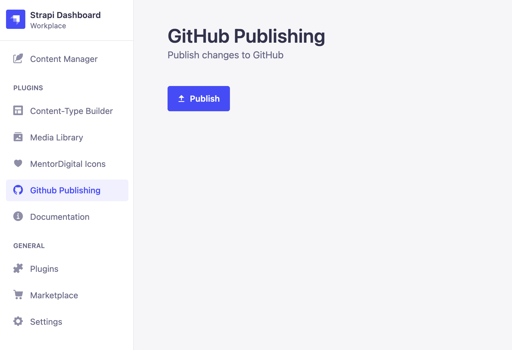

# Strapi plugin github-publish

This is a plugin for [Strapi](https://github.com/strapi/strapi) headless CMS. It lets you trigger a GitHub Action workflow when the site is ready to be published.

## Introduction



When using Strapi as a headless CMS for a statically built website you need a way to trigger the site to rebuild when content has been updated. The typical approach is to setup a Strapi managed webhook to trigger a CI/CD pipeline whenever content changes. This approach has it's issues. For example when making many changes to content, builds are triggered multiple times and deployments can fail due to the site being deployed concurrently.

This plugin tackles the publishing flow a different way. The site administrators can take their time and make many changes and once the content update is complete they can trigger a single build.

This plugin also checks to see if an `in_progress` build is active and not allow the user to trigger another. Also, when a build has been triggered the user can wait on the plugin page to see when the build and deployment has completed.

## Installation

Install this plugin with npm or yarn.

With npm:

```bash
npm install strapi-plugin-github-publish
```

With yarn:

```bash
yarn add strapi-plugin-github-publish
```

## Configuration

Generate a config file at `config/plugins.js` or `config/development/plugins.js` etc...

```javascript
module.exports = ({ env }) => ({
  "github-publish": {
    owner: "username", // The gothub organisation or user
    repo: "reponame", // The name of the repository
    workflow_id: "rebuild.yml", // The workflow_id or filename
    token: env("GITHUB_TOKEN"), // The GitHub personal access token with access to trigger workflows and view build status
    branch: "master", // The branch the workflow should be triggered on
  },
});
```

Make sure you have variable in your .env file

```bash
GITHUB_TOKEN=XXXXXXX
```

## Use the Plugin

When the plugin has been installed correctly just click on `GitHub Publishing` in the sidebar under plugins then click "Publish".
